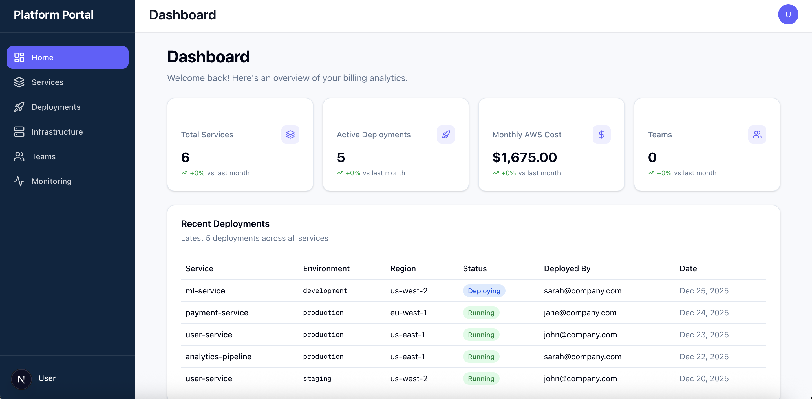
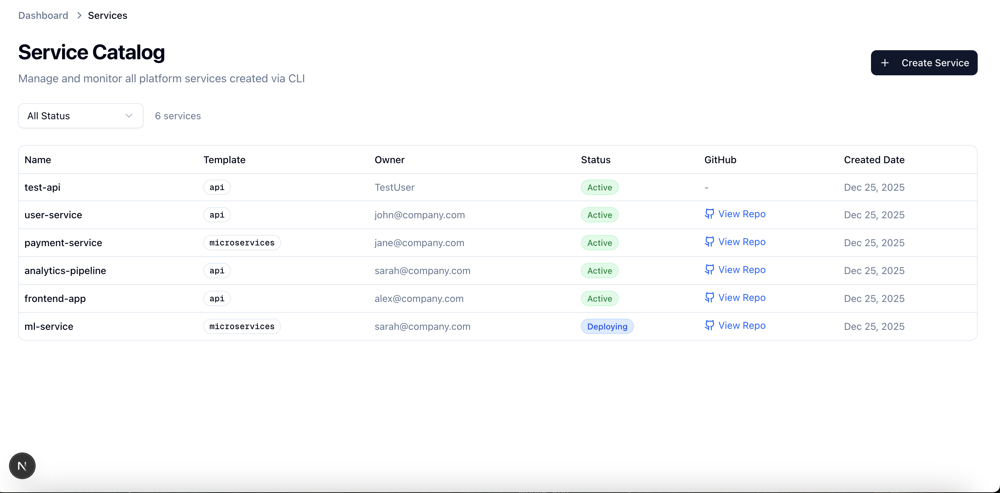
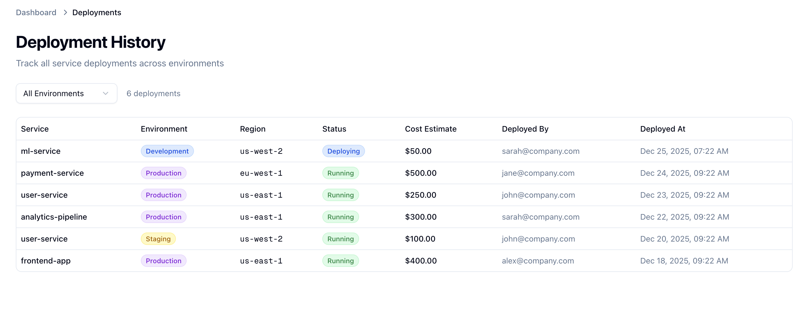
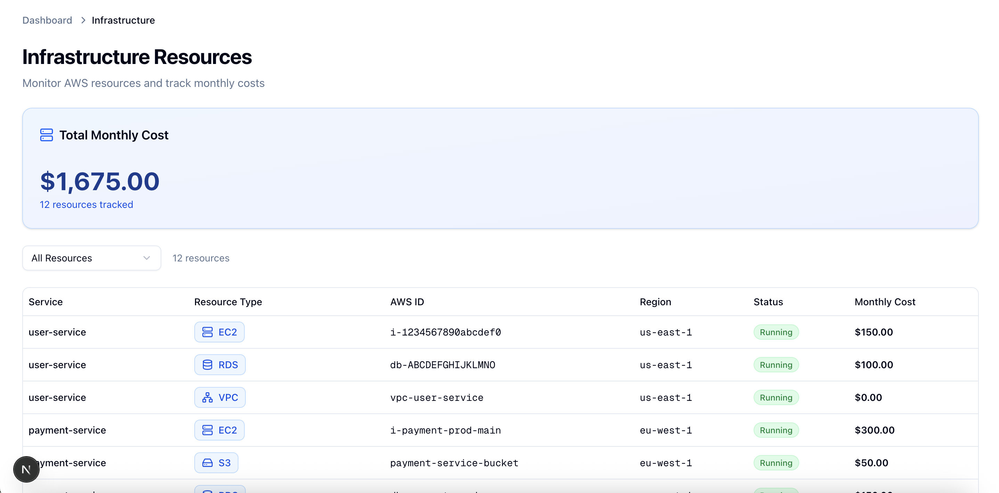
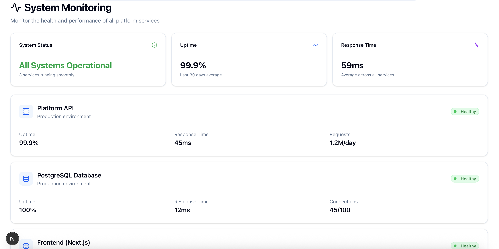

# Platform Portal

Internal Developer Portal for the [Platform Engineering Toolkit](https://github.com/GoddeyUwamari/platform-engineering-toolkit) - A production-ready monorepo with Next.js 15 frontend and Express.js backend for managing services, deployments, and AWS infrastructure.



## 🎯 What is This?

A complete platform engineering solution that provides visibility and management for services created via the Platform CLI. Track deployments, monitor AWS resources, and manage costs—all from a beautiful web dashboard.

## ✨ Features

### 📊 Dashboard
- Real-time platform metrics (services, deployments, costs)
- Recent deployment history
- Service health overview
- Monthly AWS cost tracking

### 🚀 Service Catalog
- View all services created via CLI
- Filter by template type (API, Microservices)
- GitHub repository links
- Service status tracking



### 🔄 Deployment History
- Track deployments across environments (dev, staging, production)
- Deployment status and cost estimates
- AWS region information
- Deployed by user tracking



### ☁️ Infrastructure Monitoring
- AWS resource tracking (EC2, RDS, S3, Lambda, VPC, CloudFront, ELB)
- Monthly cost breakdown per resource
- Resource status monitoring
- Filter by resource type



### 👥 Teams & Monitoring
- Team management and service ownership
- System health monitoring
- Service uptime tracking

## 🏗️ Architecture

### Monorepo Structure
```
platform-portal/
├── backend/              # Express.js + TypeScript API
│   ├── src/
│   │   ├── config/      # Database configuration
│   │   ├── controllers/ # Request handlers
│   │   ├── middleware/  # Express middleware
│   │   ├── repositories/# Data access layer
│   │   ├── routes/      # API routes
│   │   ├── types/       # TypeScript types
│   │   └── server.ts    # Express app
│   ├── package.json
│   └── tsconfig.json
├── app/                 # Next.js 15 frontend
├── components/          # React components
├── lib/                 # Frontend utilities
├── database/            # PostgreSQL migrations & seeds
└── package.json         # Root workspace config
```

### Tech Stack

**Frontend:**
- Next.js 15 (App Router)
- React 19
- TypeScript
- Tailwind CSS v4
- Radix UI components
- React Query (data fetching)
- Zustand (state management)

**Backend:**
- Express.js
- TypeScript
- PostgreSQL
- Node.js 20+

**DevOps:**
- Docker (PostgreSQL)
- npm workspaces (monorepo)
- Concurrent dev servers

## 🚀 Quick Start

### Prerequisites

- Node.js 20+
- Docker (for PostgreSQL)
- npm or yarn

### Installation
```bash
# Clone the repository
git clone https://github.com/GoddeyUwamari/platform-portal.git
cd platform-portal

# Install dependencies (root + backend)
npm install

# Start PostgreSQL
docker run -d \
  --name platform-postgres \
  -e POSTGRES_PASSWORD=postgres \
  -e POSTGRES_DB=platform_portal \
  -p 5432:5432 \
  postgres:14

# Run database migrations
node database/migrate.js

# Optional: Seed sample data
psql -h localhost -U postgres -d platform_portal -f database/seeds/001_platform_seed.sql

# Start both frontend and backend
npm run dev
```

**Servers will start:**
- Frontend: http://localhost:3010
- Backend API: http://localhost:8080
- Health check: http://localhost:8080/health

### Development
```bash
# Start both services
npm run dev

# Start frontend only
npm run dev:frontend

# Start backend only
npm run dev:backend

# Build for production
npm run build

# Start production servers
npm start
```

## 📡 API Endpoints

### Services
```
GET    /api/services              # List all services
POST   /api/services              # Create service
GET    /api/services/:id          # Get service by ID
PUT    /api/services/:id          # Update service
DELETE /api/services/:id          # Delete service
```

### Deployments
```
GET    /api/deployments           # List deployments
POST   /api/deployments           # Record deployment
GET    /api/deployments/:id       # Get deployment details
DELETE /api/deployments/:id       # Delete deployment
```

### Infrastructure
```
GET    /api/infrastructure        # List AWS resources
POST   /api/infrastructure        # Add resource
GET    /api/infrastructure/costs  # Cost breakdown
```

### Platform Stats
```
GET    /api/platform/stats/dashboard  # Dashboard metrics
```

### Teams
```
GET    /api/teams                 # List teams
GET    /api/teams/:id/services    # Team's services
POST   /api/teams                 # Create team
```

## 🗄️ Database Schema
```sql
-- Teams
CREATE TABLE teams (
  id UUID PRIMARY KEY,
  name VARCHAR(255) UNIQUE,
  description TEXT,
  owner VARCHAR(255),
  members TEXT[],
  created_at TIMESTAMP DEFAULT NOW()
);

-- Services
CREATE TABLE services (
  id UUID PRIMARY KEY,
  name VARCHAR(255),
  template VARCHAR(50),
  owner VARCHAR(255),
  team_id UUID REFERENCES teams(id),
  github_url TEXT,
  status VARCHAR(50),
  created_at TIMESTAMP DEFAULT NOW()
);

-- Deployments
CREATE TABLE deployments (
  id UUID PRIMARY KEY,
  service_id UUID REFERENCES services(id),
  environment VARCHAR(50),
  aws_region VARCHAR(50),
  status VARCHAR(50),
  cost_estimate DECIMAL(10,2),
  deployed_by VARCHAR(255),
  deployed_at TIMESTAMP DEFAULT NOW()
);

-- Infrastructure Resources
CREATE TABLE infrastructure_resources (
  id UUID PRIMARY KEY,
  service_id UUID REFERENCES services(id),
  resource_type VARCHAR(50),
  aws_id VARCHAR(255),
  aws_region VARCHAR(50),
  status VARCHAR(50),
  cost_per_month DECIMAL(10,2),
  created_at TIMESTAMP DEFAULT NOW()
);
```

## 🔗 Integration with Platform CLI

The portal integrates seamlessly with the [Platform Engineering Toolkit](https://github.com/GoddeyUwamari/platform-engineering-toolkit):
```bash
# CLI creates service and notifies portal
platform create api my-service --github

# CLI deploys and records in portal
platform deploy aws my-service
```

## 📸 Screenshots

### Dashboard


### Services


### Deployments


### Infrastructure


### Teams


### Monitoring


## 🤝 Contributing

This is a portfolio project, but feedback and suggestions are welcome!

1. Fork the repository
2. Create a feature branch
3. Make your changes
4. Submit a pull request

## 📝 License

MIT License - see LICENSE file for details

## 👤 Author

**Goddey Uwamari**

- 🏢 Founder & CEO, WayUP Technology
- 💼 Senior Full-Stack & Platform Engineer
- 🌐 GitHub: [@GoddeyUwamari](https://github.com/GoddeyUwamari)
- 🔗 LinkedIn: [Goddey Uwamari](https://www.linkedin.com/in/goddeyuwamari)

## 🙏 Acknowledgments

- Built with Next.js 15, React 19, and Express.js
- Inspired by modern platform engineering practices
- Part of the Platform Engineering Toolkit ecosystem

## 🔗 Related Projects

- [Platform Engineering Toolkit](https://github.com/GoddeyUwamari/platform-engineering-toolkit) - CLI tool for service creation and AWS deployment